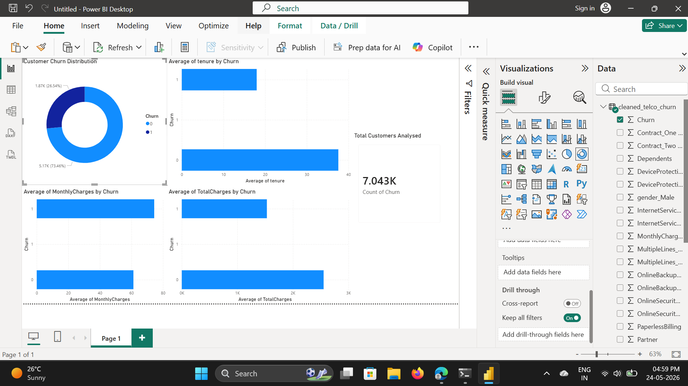
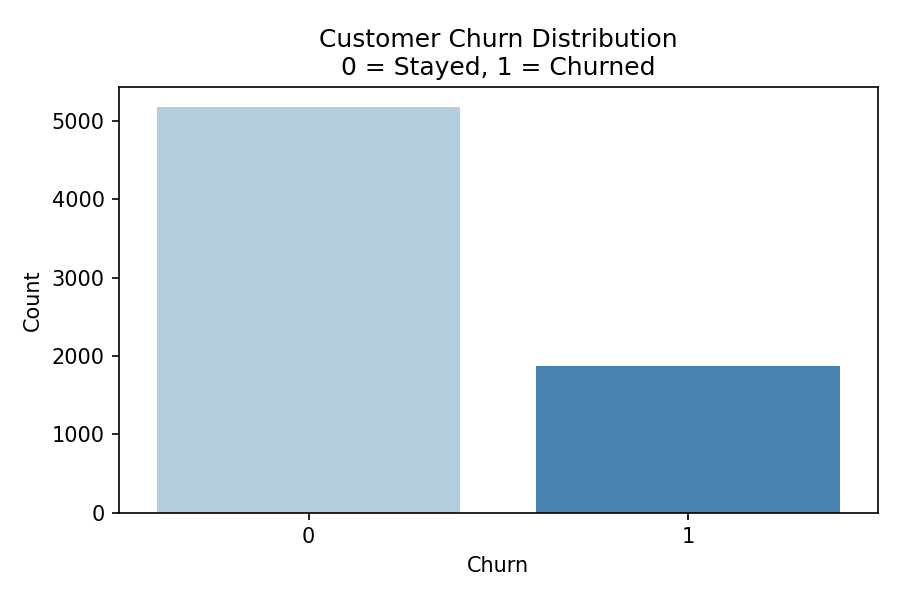
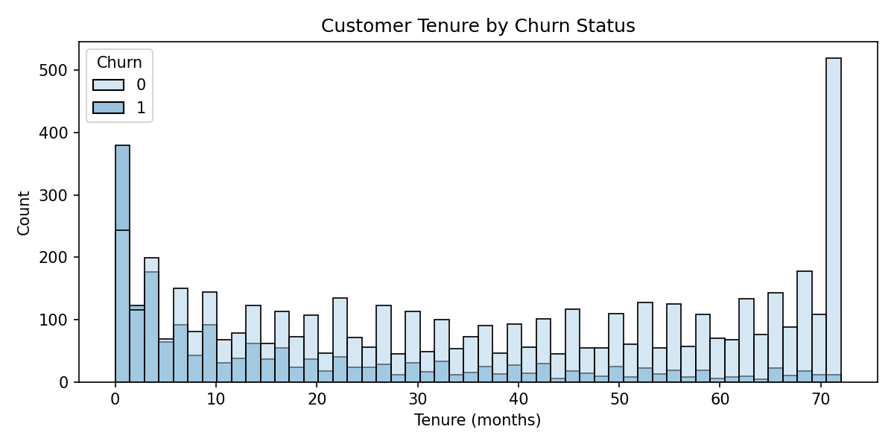
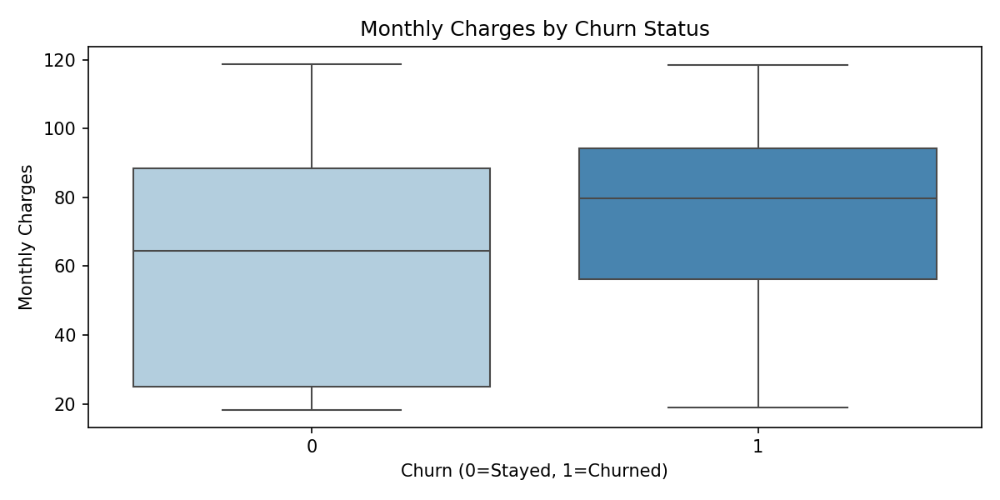

# customer-churn-prediction
"Customer Churn Prediction | Python, Scikit-learn | 7,043 records | ROC-AUC 0.842 | Logistic Regression beats Random Forest"
# Customer Churn Prediction 📱

## Project Overview
Telecom companies lose significant revenue when customers cancel their subscriptions. 
This project builds a machine learning pipeline to predict customer churn using 
7,043 real telecom customer records. The goal is to identify customers likely to 
leave so the business can take proactive retention action.

## Results
| Model | Accuracy | ROC-AUC |
|---|---|---|
| Logistic Regression | 81% | 0.842 |
| Random Forest | 79% | 0.825 |

**Best Model: Logistic Regression — ROC-AUC 0.842**
**Key Finding: Logistic Regression outperformed Random Forest — simpler models win on clean data!**

---

## Key Findings
- Total Charges is the strongest predictor of churn (17.9% importance)
- Newer customers (low tenure) are most likely to churn (16.3%)
- Higher monthly charges drive churn (15.4%)
- Customers on month-to-month contracts churn significantly more
- Electronic check payment method linked to higher churn
- 26.5% churn rate — better balanced than typical datasets

---
## Power BI Dashboard

## Visualisations

### Churn Distribution

### Tenure vs Churn

### Monthly Charges vs Churn

### Feature Importance

---

## Business Recommendations
Based on the model findings:
- Target retention campaigns at customers in first 12 months
- Offer discounts to high monthly charge customers showing churn signals
- Incentivise customers to switch from month-to-month to annual contracts
- Investigate why electronic check users churn more

---

## Tech Stack
- Python, Pandas, NumPy
- Scikit-learn (Logistic Regression, Random Forest)
- Matplotlib, Seaborn
- Jupyter Notebook
- Power BI (dashboard)

---

## Dataset
- Records: 7,043 telecom customers
- Features: 30 (after one-hot encoding)
- Target: Churn (0 = Stayed, 1 = Churned)
- Churn Rate: 26.5%

---

## Author
**Sanika Prasad Naik**
MSc Data Science — University of Birmingham, UK
- LinkedIn: linkedin.com/in/sanikanaik1308
- GitHub: github.com/sanikanaik456
- Email: naiksanika70@gmail.com
